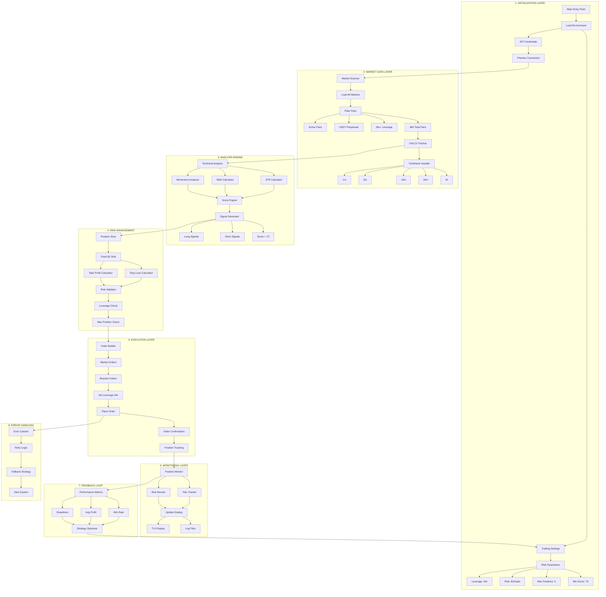
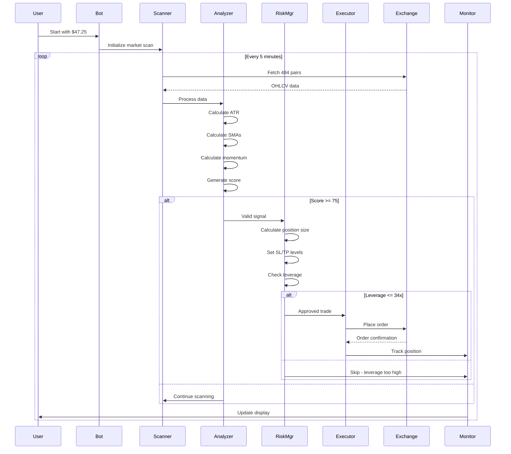
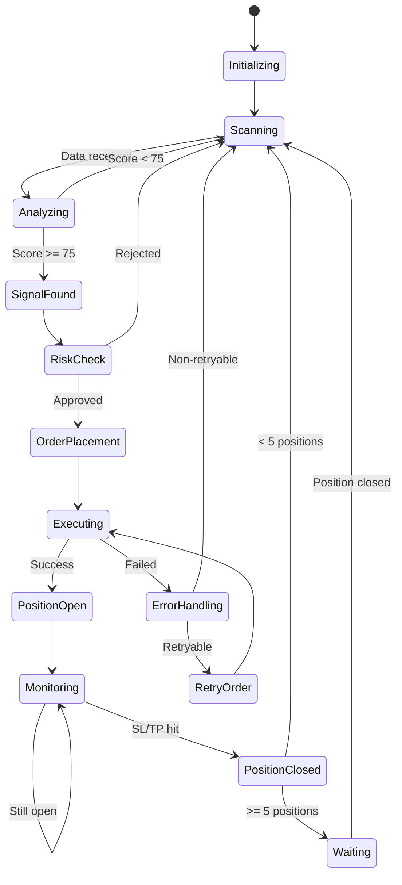
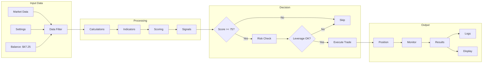

# Trading Bot System Architecture & Optimization

## Complete System Mermaid Diagram

```mermaid
graph TB
    subgraph "1. INITIALIZATION LAYER"
        A[Main Entry Point] --> B[Load Environment]
        B --> C[API Credentials]
        B --> D[Trading Settings]
        C --> E[Phemex Connection]
        D --> F[Risk Parameters]
        
        F --> F1[Leverage: 34x]
        F --> F2[Risk: $1/trade]
        F --> F3[Max Positions: 5]
        F --> F4[Min Score: 75]
    end
    
    subgraph "2. MARKET DATA LAYER"
        E --> G[Market Scanner]
        G --> H[Load All Markets]
        H --> I[Filter Pairs]
        I --> I1[Active Pairs]
        I --> I2[USDT Perpetuals]
        I --> I3[34x+ Leverage]
        I --> I4[484 Total Pairs]
        
        I4 --> J[OHLCV Fetcher]
        J --> K[Timeframe Handler]
        K --> K1[1m]
        K --> K2[5m]
        K --> K3[15m]
        K --> K4[30m]
        K --> K5[1h]
    end
    
    subgraph "3. ANALYSIS ENGINE"
        J --> L[Technical Analysis]
        L --> M[ATR Calculator]
        L --> N[SMA Calculator]
        L --> O[Momentum Analyzer]
        
        M --> P[Score Engine]
        N --> P
        O --> P
        
        P --> Q[Signal Generator]
        Q --> Q1[Long Signals]
        Q --> Q2[Short Signals]
        Q --> Q3[Score > 75]
    end
    
    subgraph "4. RISK MANAGEMENT"
        Q --> R[Position Sizer]
        R --> S[Fixed $1 Risk]
        S --> T[Stop Loss Calculator]
        S --> U[Take Profit Calculator]
        
        T --> V[Risk Validator]
        U --> V
        V --> W[Leverage Check]
        W --> X[Max Position Check]
    end
    
    subgraph "5. EXECUTION LAYER"
        X --> Y[Order Builder]
        Y --> Z[Market Orders]
        Z --> AA[Bracket Orders]
        AA --> AB[Set Leverage 34x]
        AB --> AC[Place Order]
        
        AC --> AD[Order Confirmation]
        AD --> AE[Position Tracking]
    end
    
    subgraph "6. MONITORING LAYER"
        AE --> AF[Position Monitor]
        AF --> AG[P&L Tracker]
        AF --> AH[Risk Monitor]
        
        AG --> AI[Update Display]
        AH --> AI
        AI --> AJ[TUI Display]
        AI --> AK[Log Files]
    end
    
    subgraph "7. FEEDBACK LOOP"
        AF --> AL[Performance Metrics]
        AL --> AM[Win Rate]
        AL --> AN[Avg Profit]
        AL --> AO[Drawdown]
        
        AM --> AP[Strategy Optimizer]
        AN --> AP
        AO --> AP
        AP --> D
    end
    
    subgraph "8. ERROR HANDLING"
        AC --> AQ[Error Catcher]
        AQ --> AR[Retry Logic]
        AR --> AS[Fallback Strategy]
        AS --> AT[Alert System]
    end
```

## Detailed Component Flow

```mermaid
sequenceDiagram
    participant User
    participant Bot
    participant Scanner
    participant Analyzer
    participant RiskMgr
    participant Executor
    participant Exchange
    participant Monitor
    
    User->>Bot: Start with $47.25
    Bot->>Scanner: Initialize market scan
    
    loop Every 5 minutes
        Scanner->>Exchange: Fetch 484 pairs
        Exchange-->>Scanner: OHLCV data
        Scanner->>Analyzer: Process data
        
        Analyzer->>Analyzer: Calculate ATR
        Analyzer->>Analyzer: Calculate SMAs
        Analyzer->>Analyzer: Calculate momentum
        Analyzer->>Analyzer: Generate score
        
        alt Score >= 75
            Analyzer->>RiskMgr: Valid signal
            RiskMgr->>RiskMgr: Calculate position size
            RiskMgr->>RiskMgr: Set SL/TP levels
            RiskMgr->>RiskMgr: Check leverage
            
            alt Leverage <= 34x
                RiskMgr->>Executor: Approved trade
                Executor->>Exchange: Place order
                Exchange-->>Executor: Order confirmation
                Executor->>Monitor: Track position
            else
                RiskMgr->>Monitor: Skip - leverage too high
            end
        else
            Analyzer->>Scanner: Continue scanning
        end
        
        Monitor->>User: Update display
    end
```

## State Machine Diagram

```mermaid
stateDiagram-v2
    [*] --> Initializing
    Initializing --> Scanning
    
    Scanning --> Analyzing: Data received
    Analyzing --> SignalFound: Score >= 75
    Analyzing --> Scanning: Score < 75
    
    SignalFound --> RiskCheck
    RiskCheck --> OrderPlacement: Approved
    RiskCheck --> Scanning: Rejected
    
    OrderPlacement --> Executing
    Executing --> PositionOpen: Success
    Executing --> ErrorHandling: Failed
    
    PositionOpen --> Monitoring
    Monitoring --> PositionClosed: SL/TP hit
    Monitoring --> Monitoring: Still open
    
    PositionClosed --> Scanning: < 5 positions
    PositionClosed --> Waiting: >= 5 positions
    
    Waiting --> Scanning: Position closed
    
    ErrorHandling --> RetryOrder: Retryable
    ErrorHandling --> Scanning: Non-retryable
    RetryOrder --> Executing
```

## Data Flow Diagram

```mermaid
graph LR
    subgraph "Input Data"
        MD[Market Data] --> DF[Data Filter]
        SET[Settings] --> DF
        BAL[Balance: $47.25] --> DF
    end
    
    subgraph "Processing"
        DF --> CALC[Calculations]
        CALC --> IND[Indicators]
        IND --> SCORE[Scoring]
        SCORE --> SIG[Signals]
    end
    
    subgraph "Decision"
        SIG --> DEC{Score >= 75?}
        DEC -->|Yes| RISK[Risk Check]
        DEC -->|No| SKIP[Skip]
        RISK --> LEV{Leverage OK?}
        LEV -->|Yes| TRADE[Execute Trade]
        LEV -->|No| SKIP
    end
    
    subgraph "Output"
        TRADE --> POS[Position]
        POS --> MON[Monitor]
        MON --> RES[Results]
        RES --> LOG[Logs]
        RES --> UI[Display]
    end
```